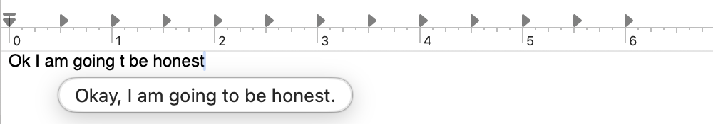

<p align="center">
  
</p>

<h1 align="center">Glide</h1>

<p align="center">
An on-device writing assistant for macOS. It finishes your sentences and fixes them, in every app.
</p>

<p align="center">
  <a href="https://github.com/redclayai/glide/releases/latest">
    
  </a>
</p>

<p align="center">
  
</p>

---

Glide watches the focused text field in any macOS app and helps in two ways. Both are accepted the
same way — press **Tab**, or click the suggestion.

**Complete.** As you type, it predicts a short continuation at the cursor and shows it as ghost text
on the line. Tab takes the next word; keep pressing to take more.

**Rewrite.** When you finish a word it checks the spelling. When you stop typing for a moment it
reads the whole sentence and offers a grammar fix — the correction appears in a capsule under the
cursor, as above. Nothing is changed until you accept it.

Everything runs **on your Mac**. No account, no network calls, no telemetry. The model lives in
`~/Library/Application Support/`, and the app works with the Wi-Fi off.

## What makes it usable rather than annoying

An assistant that interrupts you is worse than no assistant, so most of the work here is in deciding
when to say nothing:

- **The pause is the signal.** The grammar pass only runs after you stop typing for about a second.
  Keep typing and the pending check is cancelled before the model is ever asked.
- **A correction, not a rewrite.** Whatever the model proposes is measured against what you wrote,
  and discarded unless most of your own words survive it. Re-voicing your sentence is a different
  feature, and it is not this one.
- **It stays out of code.** Emails, file paths, URLs, identifiers, version strings and anything with
  a bracket in it are left alone. So are password fields.
- **One suggestion at a time.** The completion owns the cursor while you are mid-flow; a grammar fix
  only takes it over once you have stopped, and clears the completion when it does.

When a suggestion isn't obviously right, Glide shows nothing. That is the intended behaviour, not a
failure to fire.

## Also included

**Polish and Grammar on a selection.** Select text anywhere and press **⌃⌥P** to polish it or
**⌃⌥G** to fix its grammar. Unlike the inline path this works on a selection of any size, and it
works in Electron apps that expose nothing to the accessibility API.

## Installing

Download the latest `Glide.dmg` from [Releases](https://github.com/redclayai/glide/releases/latest)
and drag it to `/Applications`. The build is signed and notarized, so it opens normally.

On first launch Glide asks for **Accessibility** permission — it needs this to see the text field
you are typing in and to insert a suggestion when you accept one. It then downloads its language
model (about 1.2 GB, one time).

Requires **macOS 14 or later** on **Apple Silicon**. Glide updates itself from here on.

## Settings

In the menu bar → Settings → General:

| Setting | What it does |
|---|---|
| Completions enabled | The Tab-autocomplete path |
| Fix the word I just typed | Spelling correction. Instant, offline, no model |
| Fix the grammar of the sentence I just finished | The model grammar pass, after a pause |
| Polish & Grammar on selected text | The ⌃⌥P / ⌃⌥G selection actions |

Per-app behaviour, acceptance shortcuts, and excluded apps are configurable there too.

## Development

Requires macOS 14+, a recent Xcode, and the vendored llama.cpp xcframework, which lives outside git
— fetch [llama-b9402-xcframework.zip](https://github.com/ggml-org/llama.cpp/releases/download/b9402/llama-b9402-xcframework.zip)
and put `llama.xcframework` at `Packages/ModelRuntime/Vendor/`.

```sh
open KeyType.xcworkspace     # the scheme still carries the upstream name; the product is Glide
```

The logic lives in local SwiftPM packages under `Packages/`, which build and test far faster than
the app target:

```sh
swift test --package-path Packages/Proofreading
swift test --package-path Packages/TextInsertion
```

`docs/` is the authoritative brief — start at `docs/00-overview.md`. Design decisions are recorded
as ADRs in `docs/05-decisions.md`. When a suggestion does or doesn't appear and you want to know
why, read the prediction log rather than guessing:

```sh
tail -f ~/Library/Application\ Support/KeyType/Logs/predictions.log
```

Releases are cut by `Scripts/release.sh`, which archives, notarizes, builds the DMG, updates the
Sparkle appcast and publishes the GitHub release.

## Built on KeyType

Glide is a fork of [**KeyType**](https://github.com/johnbean393/KeyType) by Xi Nai Lai — an
open-source, on-device tab-autocomplete utility for macOS, MIT licensed. The entire capture →
prompt → model → constrained decode → overlay → insert pipeline is KeyType's work, and it is the
reason this app exists. Glide adds the rewrite path on top of it.

If you only want autocomplete, use KeyType directly. It is excellent, and it is upstream.

## License

MIT — see [LICENSE](LICENSE). Upstream's copyright is retained alongside Red Clay's.
